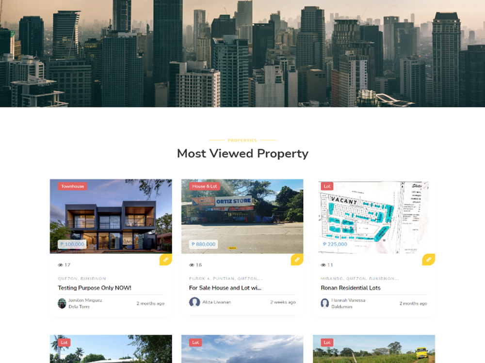
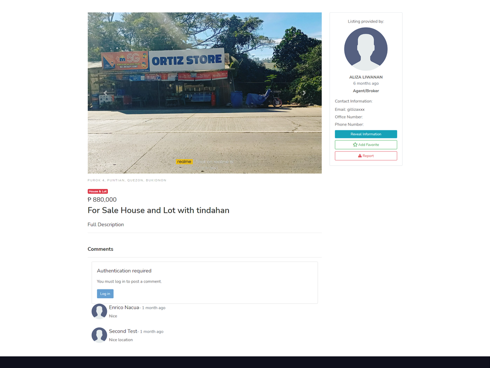

## About Real Estate System

Real Estate System is a Laravel framework web-based system that helps property seekers look for information on any kind of property in that location and helps
the real estate agents advertise the property they want to sell. There are two users in the system such as:

Customer/Agent

- can manage property such as create, update, view and publish property online to view and search it in the index or main page
- can comment, add favorite property
- add testimonial 
- manage their profile
- can report abuse in case a certain agent will abuse the system

Admin
- can manage users, and can deactivate the users
- can manage the property the same as the customers/agent
- can also add testimonial and publish it to the index or main page
- can manage their profile
- can manage report abuse, either admin will accept the report or not
- can also comment and add favorite

The system was built in 2022 so the laravel version used is laravel 8.

## License

The system is open-sourced and can be used freely.

## How to use the system?

- Run composer install && npm install
- Create .env file from .env.example
- Update .env file  for the database credentials
- Run php artisan key:generate 
- Run php artisan migrate and php artisan db:seed
- Don't forget to check the UserSeeder for the credentials of the user
- After that run php artisan serve and voila! You can now use the system.

## Sample Images
- Index page

- Property Page

